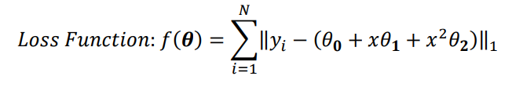

# Supervised Learning
- Ontlines:
    - Regression
        - regression.ipynb
        - regression_with_scikit-learn.ipynb
    - Classification
        - logistic_regression.ipynb
## 1. Problem Description of regression.ipynb
Please load "data.mat" into your Python code, where you will find 𝑥, 𝑦 ∈ $𝑅^{1001}.$
And do the following procedures.
1. Compute the least square line $y=\theta_0+x\theta_1$ using the given data and overlay the line over the given data.
2. Using the same data from Question 1, compute the least square parabola (i.e. 
second order polynomial $y=\theta_0+x\theta_1+x^2\theta_2$) to fit the data.
3. Using the same data from Question 2, now we use the loss function (L1 Norm) 
below instead of least square based methods.

## 2. Problem Description of regression_with_scikit-learn.ipynb
- Please analysis the relation between the house's attribute and the house price. And Report what you found.

## 3. Problem Description of logistic_regression.ipynb
- In ‘train.mat,’ you can find 2-D points X=[x1, x2] and their corresponding labels Y=y. 
- Please use logistic regression $ℎ(\theta)=\frac{1}{1+e^{-\theta^Tx}}$ to find the decision boundary (optimal $\theta^*$) based on "train.mat". 
- Please use a gradient descent method to solve it and report the test error on the test dataset "test.mat." (percentage of misclassified test samples)

## 4. Problem Description of logistic_regression2.ipynb
- The dataset contains a log of network activities from two users (named 'P' and 'R'). 
- An activity has eight different features (Field 1~8), which include categorical and numerical data.
- Our goal is to predict the user based on its activity record.
- Please use logistic regression to train a model on the training dataset (“PBP_train.csv”) and then test it on “PBP_test.csv.”

## Requirements:
- numpy
- pandas
- scikit-learn 
- seaborn (for data visulization)