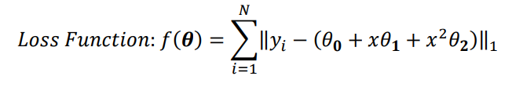

# Supervised Learning
- Ontlines:
    - Regression
        - regression.ipynb
    - Classification
        - logistic_regression.ipynb
    - PCA
        - PCA.ipynb

## 1. Problem Description of regression.ipynb
Please load "data.mat" into your Python code, where you will find 𝑥, 𝑦 ∈ $𝑅^{1001}.$
And do the following procedures.
1. Compute the least square line $y=\theta_0+x\theta_1$ using the given data and overlay the line over the given data.
2. Using the same data from Question 1, compute the least square parabola (i.e. 
second order polynomial $y=\theta_0+x\theta_1+x^2\theta_2$) to fit the data.
3. Using the same data from Question 2, now we use the loss function (L1 Norm) 
below instead of least square based methods.

## 2. Problem Description of logistic_regression.ipynb
- In ‘train.mat,’ you can find 2-D points $X=[x1, x2]$ and their corresponding labels $Y=y$. 
- Please use logistic regression $h(\theta)= \frac{1}{1+e^{-\theta^{T}x}}$ 
to find the decision boundary (optimal $\theta^*$) based on "train.mat". 
- Please use a gradient descent method to solve it and report the test error on the test dataset "test.mat." (percentage of misclassified test samples)

## 3. Problem Description of Principal Component Analysis (PCA)
Please randomly choose 1,000 different handwritten images from either the training or the testing dataset to construct your own dataset, where each digit has 100 data samples.
Normalize the data (subtracting the mean from it and then dividing it by the standard deviation) and compute the eigenpairs for the covariance of the data (sorted in a descending order based on eigenvalues).
Please use PCA to reduce the 784 dimensional data to that with 500, 300, 100, and 50 dimensions, and then show the decoding results, respectively.

## Requirements:
- numpy
- pandas
- scikit-learn 
- seaborn (for data visulization)
